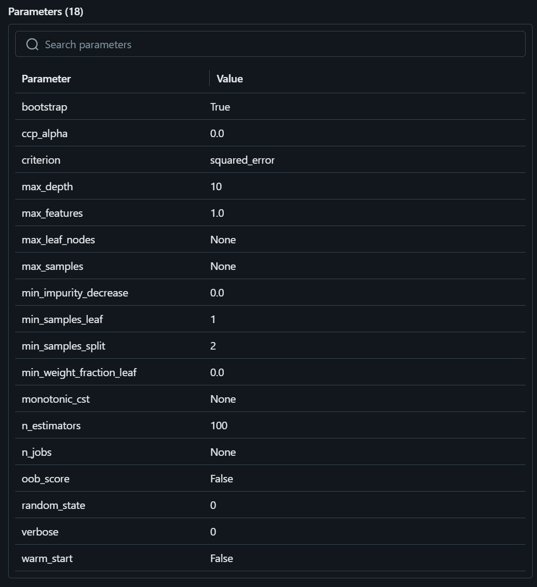

# Q1. MLflow installation

# Q2. Download and preprocess the data

# Q3. Train a model with autolog

## Added lines to train.py

## Result

# Q4. Launch the tracking server locally

# Q5. Tune model hyperparameters

## Added lines to hpo.py

 

## Result

# Q6. Promote the best model to the model registry

