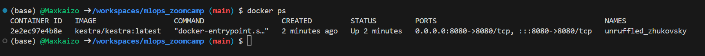
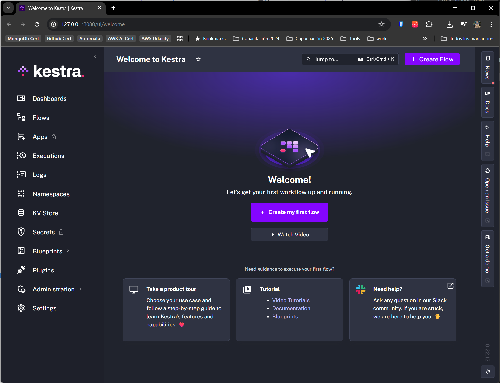
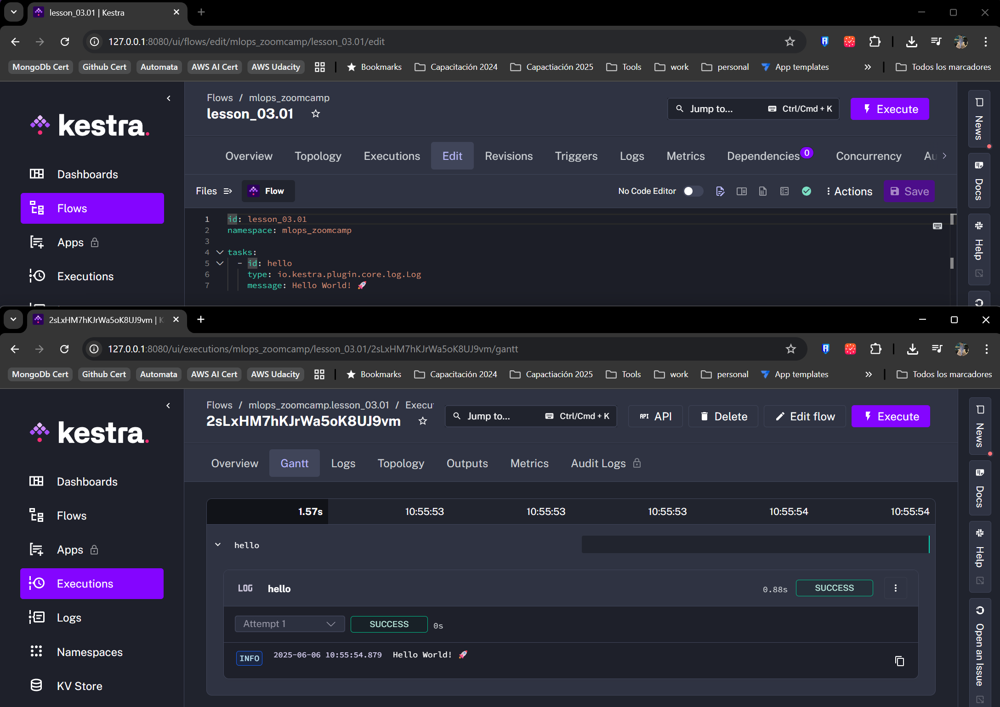
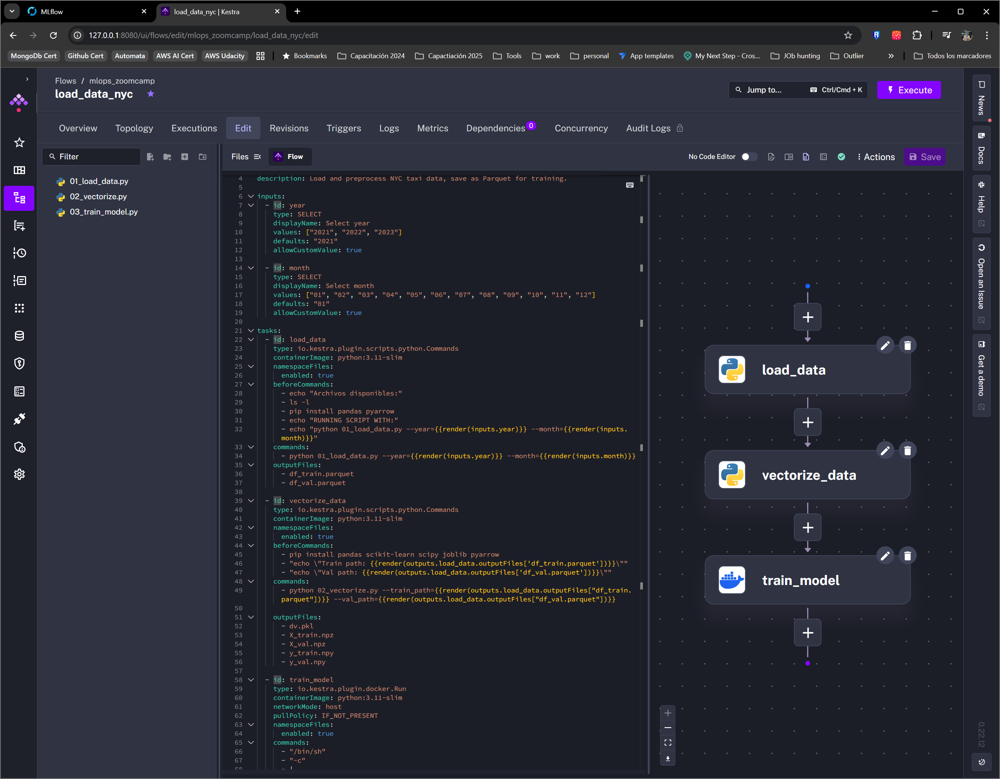
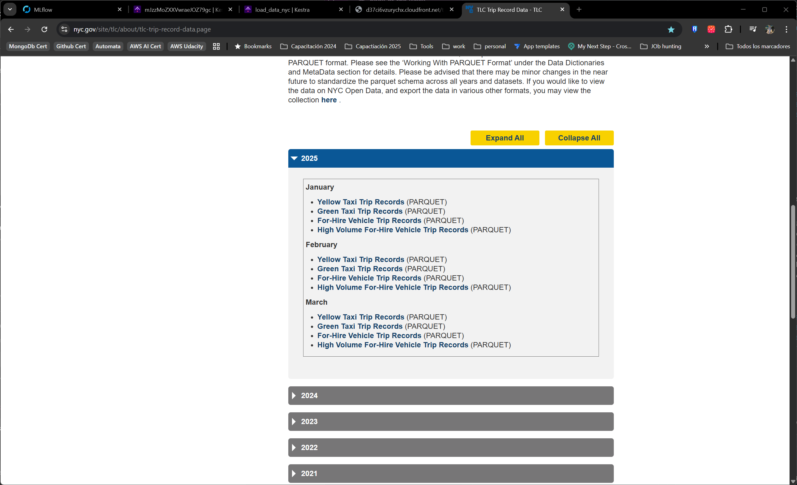
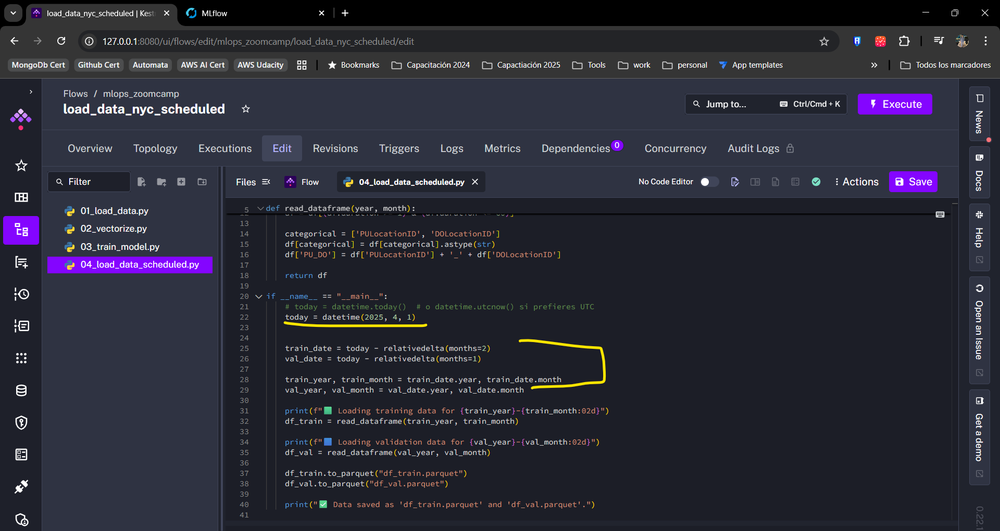
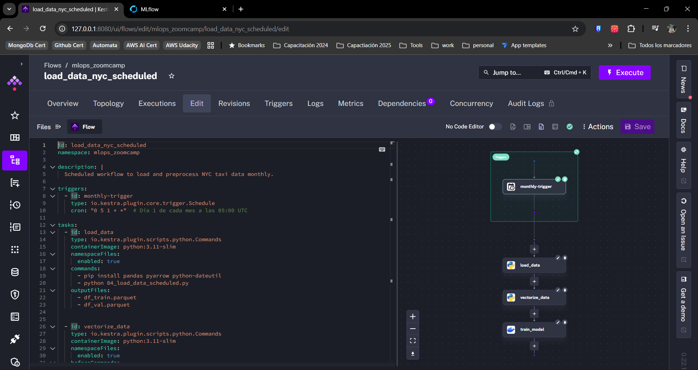

# 3. Orchestration and ML Pipelines

## 3.3 Using an Orchestrator

### Step 1: Choosing the Tool

For that you first need to choose an orchestrator. For example:

- Airflow
- Prefect
- Dagster
- Kestra
- Mage
- or some other tool

---

#### Solution. 

Let's try with Kestra, as we have used it before, it has a good documentaion base and a step learning curve, and this excercise could help as a refresher

### Step 2: Running the Tool

* Configure the tool to run locally 
* Run the simplest "hello world" workflow

#### Solution

* Configure the tool to run locally 

Here's the quickstart [guide](https://kestra.io/docs/getting-started/quickstart)

We'll start Kestra using Docker (I'm using Codespaces, so docker is preinstalled)

```bash
docker run --pull=always --rm -it -p 8080:8080 --user=root -v /var/run/docker.sock:/var/run/docker.sock -v /tmp:/tmp kestra/kestra:latest server local
```
Now we have a fresh kestra running





* Run the simplest "hello world" workflow

The simplest "Hello World" flow is also in the documentation

```yaml
id: getting_started
namespace: company.team
tasks:
  - id: hello_world
    type: io.kestra.plugin.core.log.Log
    message: Hello World!
```


### Step 3: Orchestrating the Workflow

Beyond this point, we'll need persistent storage, so we'll use Docker volumes leveragin this suggested [configuration](https://kestra.io/docs/installation/docker-compose) 

* Get the code from the previous unit (see [code](code/))
* Use the tool to orchestrate the steps in the pipeline

#### Solution.

* Divided the lesson's pipeline into 3 separate [scripts](https://github.com/Maxkaizo/mlops_zoomcamp/tree/main/03_orchestration/kestra/scripts)
* Created a [flow](https://github.com/Maxkaizo/mlops_zoomcamp/blob/main/03_orchestration/kestra/flows/load_data_nyc.yaml) in kestra  that coordinates the pipeline execution




### Step 4: Parametrizing the Workflow

* Schedule the workflow to run monthly
* The train data should be from two months ago
* The validation data - one month ago

#### Solution.

Used a quick fix, as recent data is not yet available for taxi trips



So used older files




and added the scheduled trigger




### Step 5: Backfilling

* Learn to run the workflow for some of the past months

### Step 6: Deployment (optional)

* Learn to deploy the tool to the cloud 

### Resources 

For guidance, you can refer to past cohorts of the course:

- Prefect - 2022 and 2023
- Mage - 2024

You can also rely on ChatGPT or similar tools. They are very helpful.

## 3.4 Homework

More information [here](../cohorts/2025/03-orchestration/homework.md).


## Resources

### Mlflow

If you want to run MLFlow with Docker, you can do this:

Create a dockerfile for mlflow, e.g. `mlflow.dockerfile`:

```dockerfile
FROM python:3.10-slim

RUN pip install mlflow==2.12.1

EXPOSE 5000

CMD [ \
    "mlflow", "server", \
    "--backend-store-uri", "sqlite:///home/mlflow_data/mlflow.db", \
    "--host", "0.0.0.0", \
    "--port", "5000" \
]
```

Add it to the docker-compose.yaml:

```yaml
  mlflow:
    build:
      context: .
      dockerfile: mlflow.dockerfile
    ports:
      - "5000:5000"
    volumes:
      - "${PWD}/mlflow_data:/home/mlflow_data/"
```

In your code, make sure you use the same version of mlflow (`mlflow==2.12.1`).

When you run it, mlflow should be accessible at `http://mlflow:5000`.

## Notes

### Notes previous editions

- [2022 Prefect notes](../cohorts/2022/03-orchestration/README.md)
- [2023 Prefect notes](../cohorts/2023/03-orchestration/prefect/README.md)
- [2024 Mage notes](../cohorts/2024/03-orchestration/README.md)

### Notes 2025

Did you take notes? Add them here:

* Send a PR, add your notes above this line