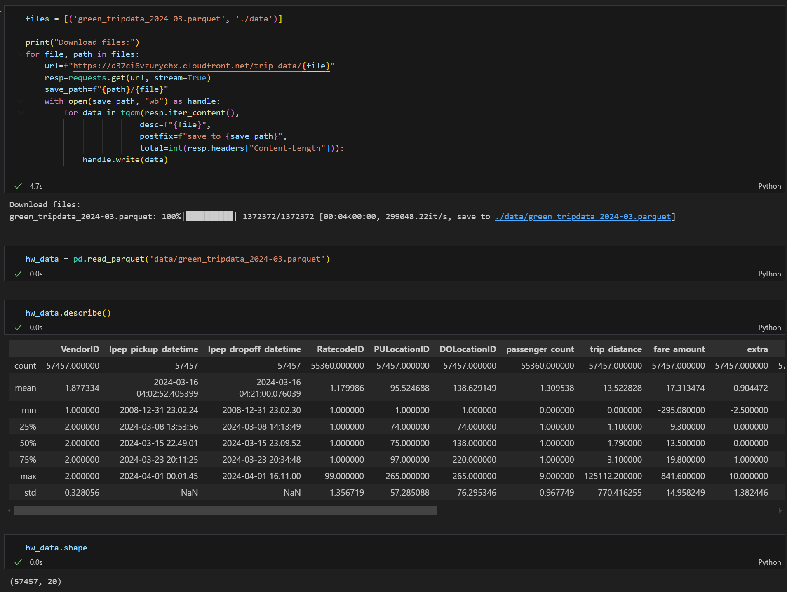
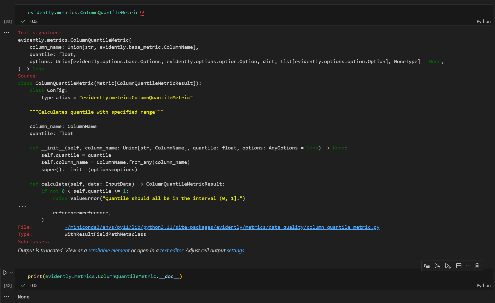
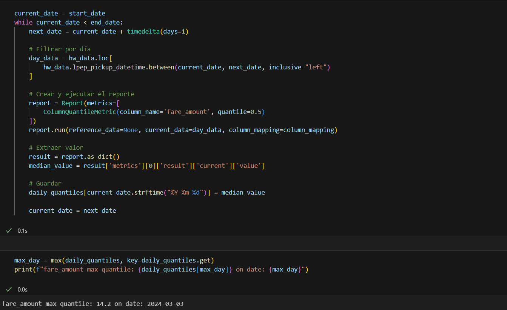
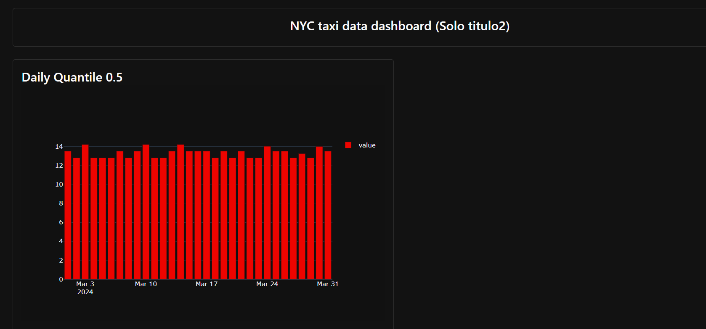
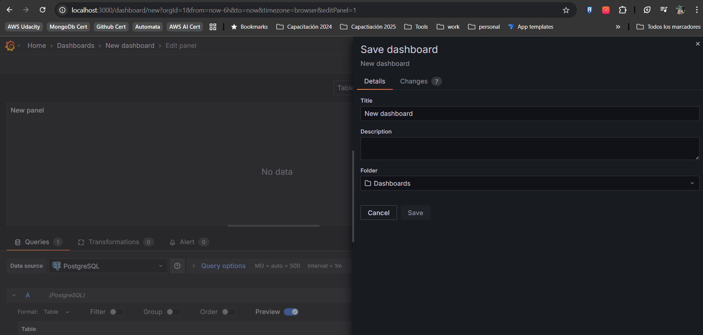
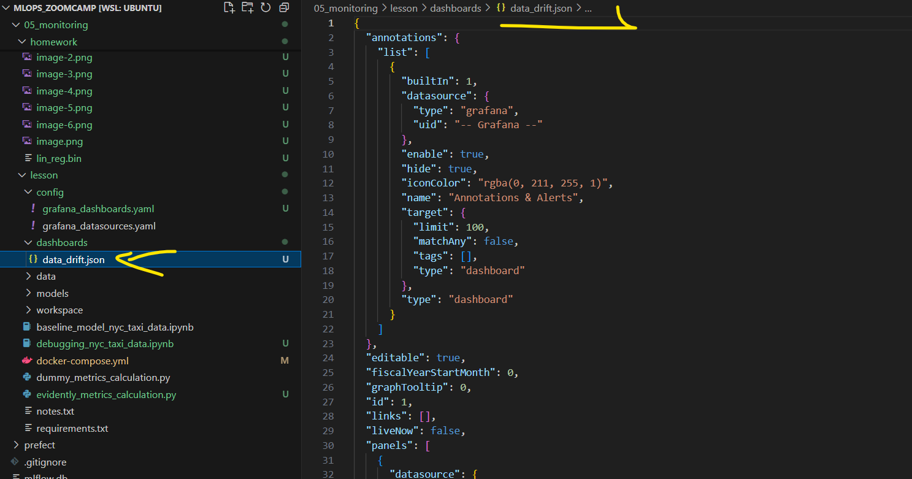

## Homework

The goal of this homework is to familiarize users with monitoring for ML batch services, using PostgreSQL database to store metrics and Grafana to visualize them.

## Q1. Prepare the dataset

Start with `baseline_model_nyc_taxi_data.ipynb`. Download the March 2024 Green Taxi data. We will use this data to simulate a production usage of a taxi trip duration prediction service.

What is the shape of the downloaded data? How many rows are there?

* 72044
* 78537 
* 57457
* 54396

### Q1. Solution

* 57457
## Q2. Metric

Let's expand the number of data quality metrics we’d like to monitor! Please add one metric of your choice and a quantile value for the `"fare_amount"` column (`quantile=0.5`).

Hint: explore evidently metric `ColumnQuantileMetric` (from `evidently.metrics import ColumnQuantileMetric`) 

What metric did you choose?

### Q2. Solution

* ColumnSummaryMetric

I chose -ColumnSummaryMetric- because i think this one is useful, but I'll also explore the suggested metric -ColumnQuantileMetric-

## Q3. Monitoring

Let’s start monitoring. Run expanded monitoring for a new batch of data (March 2024). 

What is the maximum value of metric `quantile = 0.5` on the `"fare_amount"` column during March 2024 (calculated daily)?

* 10
* 12.5
* 14.2
* 14.8

### Q3. Solution

* 14.2

## Q4. Dashboard

Finally, let’s add panels with new added metrics to the dashboard. After we customize the  dashboard let's save a dashboard config, so that we can access it later. Hint: click on “Save dashboard” to access JSON configuration of the dashboard. This configuration should be saved locally.

Where to place a dashboard config file?

* `project_folder` (05-monitoring)
* `project_folder/config`  (05-monitoring/config)
* `project_folder/dashboards`  (05-monitoring/dashboards)
* `project_folder/data`  (05-monitoring/data)

### Q4. Solution

I've added a dashboard with a single panel

There's no option to save the dashboard, so I'm gonna refer to the folder structure of the lessons repository

Also it seems that Graphana uses Dashboards folder

and the lesson's folder structure show dashboards/, so I'll go with that

