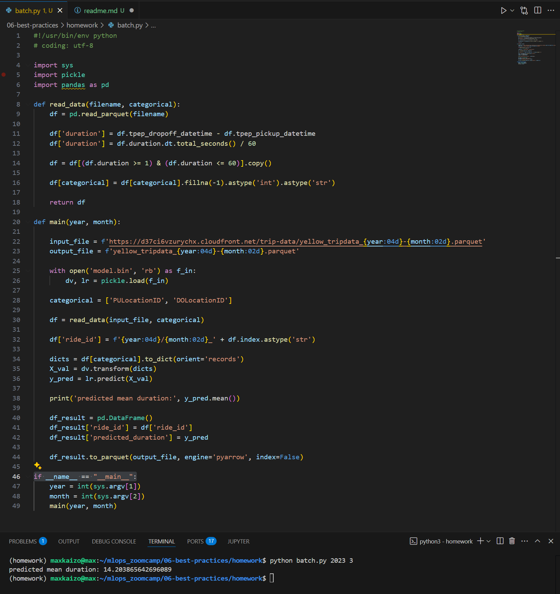
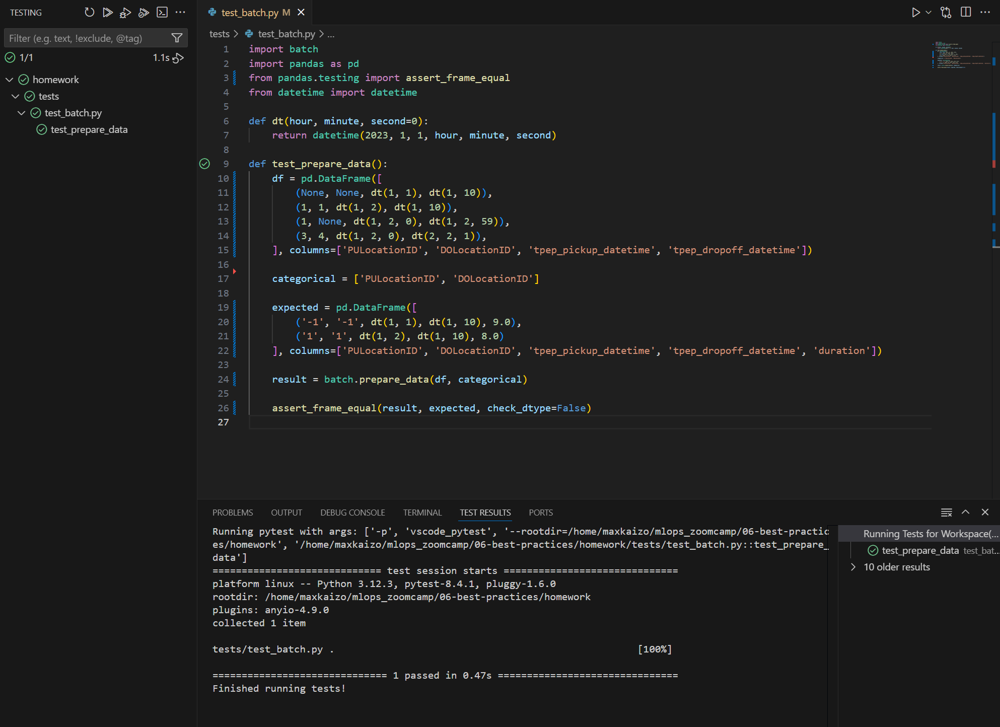
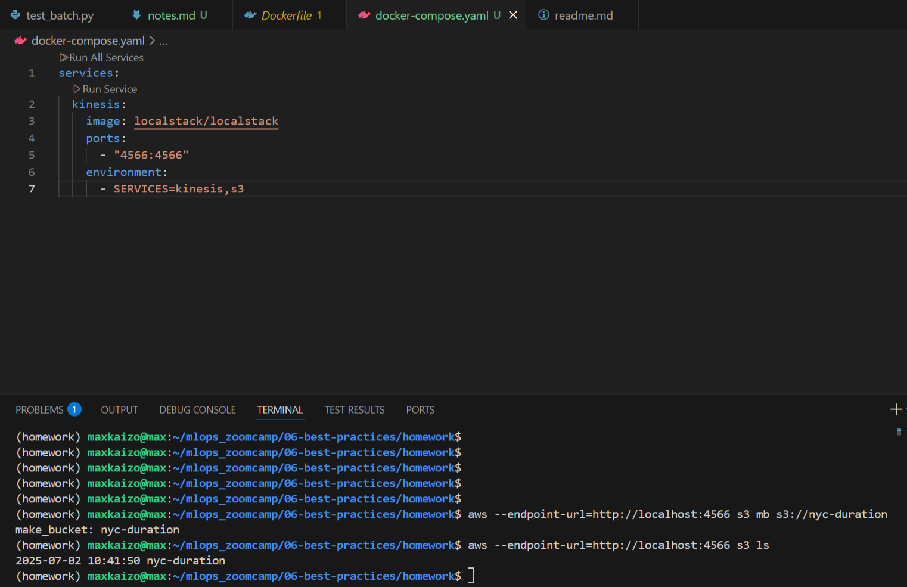
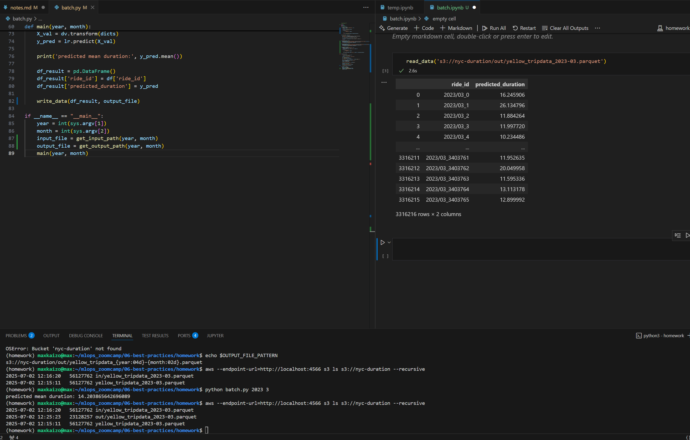

# Homework 

## Q1. Refactoring

* How does the if statement that we use for this looks like?

### Q1. Solution

* if __name__ == "__main__":

## Q2. Installing pytest

Next, create a folder tests and create two files. One will be the file with tests. We can name it test_batch.py.

* What should be the other file?

### Q2. Solution

* __init__.py

## Q3. Writing first unit test

How many rows should be there in the expected dataframe?

* 1
* 2
* 3
* 4

### Q3. Solution

* 2

## Q4. Mocking S3 with Localstack

In both cases we should adjust commands for localstack. What option do we need to use for such purposes?

* --backend-store-uri
* --profile
* --endpoint-url
* --version

### Q4. Solution

* --endpoint-url

## Migrating to localstack

* Make input and output paths configurable
* Reading from Localstack S3 with Pandas

